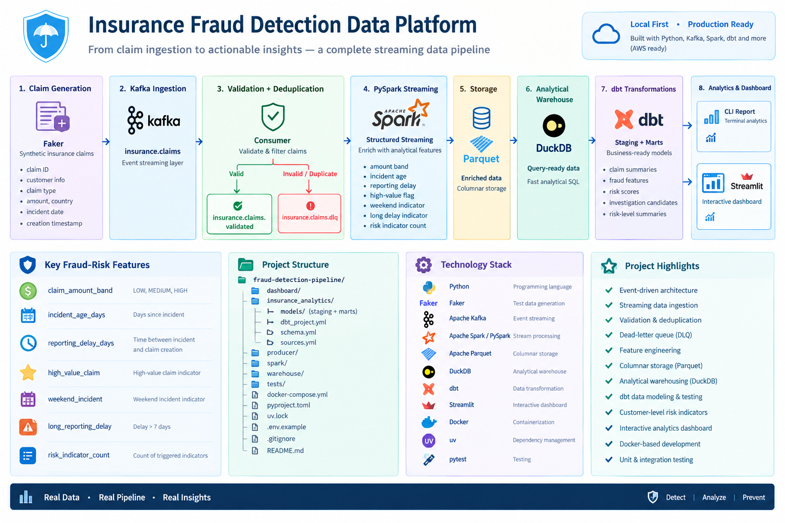

# Insurance Fraud Detection Data Platform

A local-first, end-to-end streaming data platform for processing insurance claims, validating incoming events, detecting duplicate or invalid records, enriching claims with fraud-risk indicators, and producing analytical insights through dbt and an interactive dashboard.

The project is designed to demonstrate production-oriented data engineering concepts using a lightweight local environment that can later be migrated to AWS.

---

## 🚀 Project Overview

Insurance companies process large volumes of claims from different sources. Before claims can be analyzed for potential fraud, the data needs to be:

* reliably ingested
* validated
* deduplicated
* routed when invalid
* processed in real time
* enriched with analytical features
* stored for downstream analytics
* transformed into business-ready models
* presented to analysts

This project implements that workflow as a complete streaming data platform.

### Core pipeline

```text
Faker Claim Generator
        │
        ▼
      Kafka
        │
        ▼
Validation + Deduplication
        │
   ┌────┴─────────────┐
   │                  │
 Valid          Invalid / Duplicate
   │                  │
   ▼                  ▼
Validated             DLQ
 Topic
   │
   ▼
PySpark Structured Streaming
   │
   ▼
Enriched Parquet
   │
   ▼
DuckDB Warehouse
   │
   ▼
dbt Transformations
   │
   ├───────────────┐
   ▼               ▼
Analytics      Streamlit
Report         Dashboard
```

---

## 🎯 Project Goals

The project demonstrates how to build a complete data pipeline capable of:

* streaming events through Kafka
* validating incoming claim data
* detecting duplicate claims
* separating invalid records through a dead-letter queue
* processing streaming data with PySpark
* generating fraud-related features
* storing enriched data as Parquet
* loading analytical data into DuckDB
* transforming data with dbt
* testing data quality
* calculating customer-level risk indicators
* exposing results through an interactive dashboard

---

## 🏗️ Architecture



### 1. Claim generation

Synthetic insurance claims are generated using Faker.

Each claim contains information such as:

* claim ID
* customer ID
* customer name
* claim type
* claim amount
* country
* incident date
* claim creation timestamp

The generator allows the pipeline to be tested without exposing real customer information.

### 2. Kafka ingestion

Claims are published to Kafka through the:

```text
insurance.claims
```

topic.

Kafka provides the event-streaming layer between claim generation and downstream processing.

### 3. Validation and deduplication

The Kafka consumer validates incoming claims before they enter the analytical pipeline.

Validation checks include:

* required identifiers
* customer information
* claim type
* claim amount
* country
* incident date
* creation timestamp

Invalid or malformed claims are routed to:

```text
insurance.claims.dlq
```

Duplicate detection prevents the same claim from being processed repeatedly.

Valid claims are published to:

```text
insurance.claims.validated
```

### 4. PySpark streaming

PySpark Structured Streaming consumes validated claims from Kafka.

The streaming layer converts the raw event fields into typed data and calculates additional analytical features.

Examples include:

* claim amount band
* incident age
* reporting delay
* high-value claim indicator
* weekend incident indicator
* long reporting delay indicator
* risk indicator count

The enriched records are written to Parquet.

### 5. DuckDB analytical warehouse

The Parquet data is loaded into DuckDB for analytical querying.

DuckDB provides a lightweight local analytical warehouse without requiring a separate database server.

The warehouse contains both the original claim attributes and the features generated by Spark.

### 6. dbt transformation layer

dbt transforms the warehouse data into analytical models.

The project contains staging and mart models for areas such as:

* claim summaries
* fraud features
* fraud risk scores
* investigation candidates
* risk-level summaries

The dbt project also includes automated data-quality tests.

### 7. Analytics and dashboard

The processed data is exposed through two interfaces.

**CLI analytics report**

```text
warehouse/dashboard_report.py
```

Provides a terminal-based summary of:

* total customers
* total claims
* total claim value
* risk levels
* high-risk customers
* investigation candidates

**Interactive dashboard**

```text
dashboard/app.py
```

Provides a web-based interface for exploring the fraud-risk analytics.

---

## 🧠 Fraud-Risk Features

The project currently derives several indicators from claim behavior.

| Feature                | Description                                         |
| ---------------------- | --------------------------------------------------- |
| `claim_amount_band`    | Categorizes claims into LOW, MEDIUM, or HIGH        |
| `incident_age_days`    | Days since the incident                             |
| `reporting_delay_days` | Time between incident and claim creation            |
| `high_value_claim`     | Identifies high-value claims                        |
| `weekend_incident`     | Identifies incidents occurring on weekends          |
| `long_reporting_delay` | Identifies reporting delays greater than seven days |
| `risk_indicator_count` | Counts triggered risk indicators                    |

These indicators are combined downstream to support customer-level risk analysis.

The project is intended as a **data engineering demonstration**, not as a production insurance fraud decision system.

---

## 🧪 Data Quality

Data quality is handled at multiple stages.

### Streaming validation

Invalid claims are rejected before entering the validated stream.

### Dead-letter queue

Malformed or invalid events are preserved separately in Kafka:

```text
insurance.claims.dlq
```

This allows problematic records to be investigated without stopping the main pipeline.

### dbt tests

The dbt project includes automated tests covering the analytical models.

Current end-to-end dbt verification:

```text
PASS=41
WARN=0
ERROR=0
SKIP=0
NO-OP=0
REUSED=0
TOTAL=41
```

---

## 📊 Verified Pipeline Results

The current local dataset successfully produced:

```text
Total customers:       50
Total claims:          188
Total claim value:     2,466,357.28
High-risk customers:   25
```

The pipeline has been verified across the major stages:

* Kafka ingestion
* consumer validation
* duplicate detection
* DLQ routing
* validated Kafka topic
* PySpark streaming
* Parquet output
* Spark batch reading
* DuckDB warehouse loading
* dbt transformations and tests
* CLI analytics
* interactive dashboard

---

## 🛠️ Technology Stack

| Layer                 | Technology             |
| --------------------- | ---------------------- |
| Language              | Python                 |
| Event generation      | Faker                  |
| Streaming platform    | Apache Kafka           |
| Stream processing     | Apache Spark / PySpark |
| Storage format        | Apache Parquet         |
| Analytical warehouse  | DuckDB                 |
| Transformation        | dbt                    |
| Dashboard             | Streamlit              |
| Containers            | Docker                 |
| Dependency management | uv                     |
| Testing               | pytest                 |
| Operating environment | Local Docker / Windows |

---

## 📁 Project Structure

```text
fraud-detection-pipeline/

├── dashboard/
│   └── app.py
│
├── insurance_analytics/
│   ├── models/
│   │   ├── staging/
│   │   └── marts/
│   ├── dbt_project.yml
│   └── ...
│
├── producer/
│   ├── claim_generator.py
│   ├── consumer.py
│   ├── duplicate_checker.py
│   ├── logging_config.py
│   ├── producer.py
│   └── validator.py
│
├── spark/
│   ├── claims_analytics.py
│   ├── docker_kafka_stream.py
│   └── read_parquet.py
│
├── warehouse/
│   ├── dashboard_report.py
│   ├── load_claims.py
│   ├── queries.sql
│   └── run_queries.py
│
├── tests/
│   ├── unit/
│   └── integration/
│
├── docker-compose.yml
├── pyproject.toml
├── uv.lock
├── .env.example
├── .gitignore
└── README.md
```

---

## 💻 Running the Project

### Prerequisites

* Docker Desktop
* Python 3.13+
* uv
* Git

### Install dependencies

```bash
uv sync
```

### Start Kafka

```bash
docker compose up -d
```

### Run the consumer

Start the consumer first so that it is ready to receive incoming claims.

In one terminal:

```bash
uv run python -m producer.consumer
```

### Run the producer

In another terminal:

```bash
uv run python -m producer.producer --claims 10 --interval 0
```

### Run the PySpark streaming pipeline

The Spark streaming workload runs inside Docker to provide a consistent Spark/Hadoop runtime.

```bash
docker run --rm \
  --network fraud-detection-pipeline_default \
  -e PYTHONPATH=/opt/spark-apps \
  -v "${PWD}:/opt/spark-apps" \
  spark:3.5.8-scala2.12-java11-ubuntu \
  /opt/spark/bin/spark-submit \
  --master local[2] \
  --packages org.apache.spark:spark-sql-kafka-0-10_2.12:3.5.0 \
  /opt/spark-apps/spark/docker_kafka_stream.py
```

The streaming job writes enriched claims to:

```text
spark/output/enriched_claims/
```

### Load the warehouse

```bash
uv run python -m warehouse.load_claims
```

### Run dbt

```bash
cd insurance_analytics
uv run dbt debug
uv run dbt build
```

### Run the interactive dashboard

From the project root:

```bash
uv run streamlit run dashboard/app.py
```

---

## 🧪 Testing

Run the complete Python test suite:

```bash
uv run pytest
```

The project contains both unit and integration tests covering:

* claim validation
* date validation
* duplicate detection
* producer behavior
* consumer behavior
* malformed events
* invalid claims
* missing fields
* routing to the correct Kafka topic

---

## 🔄 Future AWS Architecture

The project is intentionally designed to be developed locally first and migrated to AWS later.

Potential AWS equivalents include:

```text
Local                       AWS

Kafka                  →    Amazon MSK
Parquet                →    Amazon S3
PySpark                →    AWS Glue / EMR
DuckDB                 →    Amazon Redshift / Athena
dbt                    →    dbt on AWS infrastructure
Streamlit              →    Cloud-hosted dashboard
Docker                 →    ECS / EKS
```

The local architecture therefore acts as a low-cost development environment while keeping the core data-engineering concepts transferable to cloud infrastructure.

---

## 📌 Portfolio Highlights

This project demonstrates practical experience with:

* event-driven architecture
* streaming data ingestion
* Kafka topic design
* dead-letter queues
* data validation
* duplicate detection
* distributed data processing
* Spark Structured Streaming
* columnar storage
* analytical warehousing
* dbt data modeling
* automated data-quality testing
* fraud-risk feature engineering
* interactive analytics
* Docker-based development
* modular Python application design
* unit and integration testing

---

## 📈 Project Status

**Current status: End-to-end pipeline verified locally.**

The next development phase focuses on improving the project's documentation, architecture presentation, reproducibility, and cloud-readiness.
